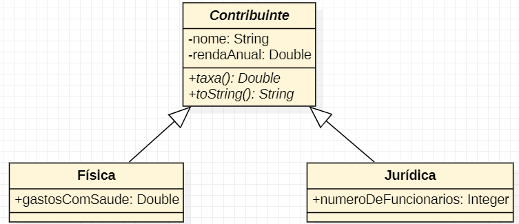

# Udemy - Java Completo 2023 - Solução Exercício de Fixação

Esta é uma solução para o Exercício de Fixação do curso Java Orientado a Ojeto.  

## Índice

- [Visão geral](#overview)
  - [Captura de tela](#screenshot)
  - [Links](#links)
- [Meu processo](processo #my)
  - [Construído com](#built-com)
  - [Recursos úteis](#useful-recursos)
- [Autor](#author)

## Overview

### Screenshot

### Links

- Solution URL: [Add solution URL here](https://staruml.io/)

## Meu processo

### Construído com

- Programação Orientada a Objetos (POO) em Java
- Estruturas de controle de fluxo, como if/else
- Classes e herança de classes
- Sobrescrita de métodos e polimorfismo
- Coleções em Java, como ArrayList
- Entrada e saída de dados com a classe Scanner
- Manipulação de strings com o método String.format()

### Recursos úteis

- [StarUML](https://developer.mozilla.org/pt-BR/) - Foi de grande importância a criação de um diagrama para me basear durante o processo de desenvolvimento do desafio, pois isso permitiu que eu visualizasse com mais clareza a estrutura do código e pudesse trabalhar de forma mais coesa e organizada.

## Autor

- Website - [João Felipe - Development Software](https://felipemt21.github.io/curriculo/)
- Mentor Frontend - [@FelipeMT21](https://www.frontendmentor.io/profile/FelipeMT21)
- Linkedin - [João Felipe](https://www.linkedin.com/in/jo%C3%A3o-felipe-1028aa210/)
- GitHub - [FelipeMT21](https://github.com/FelipeMT21)
